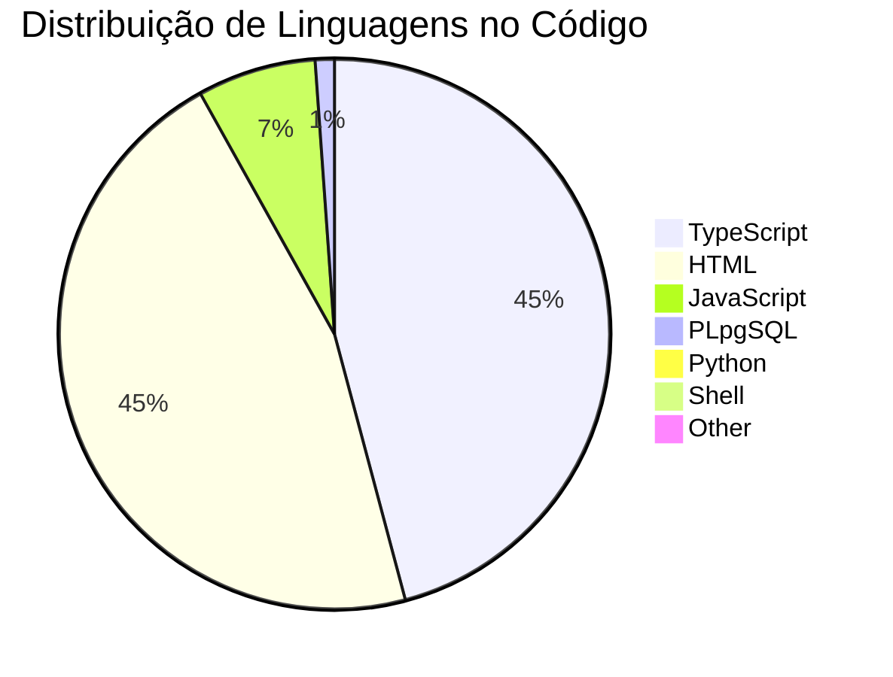
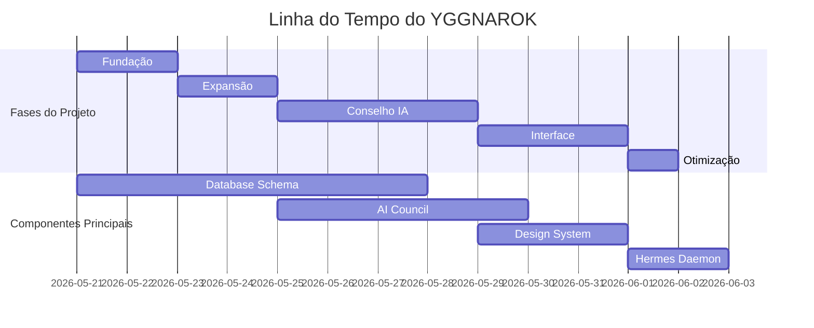
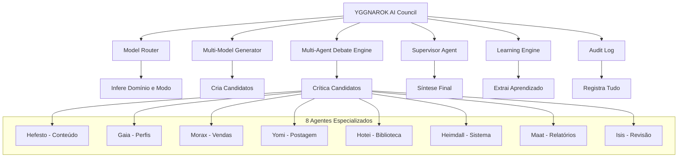
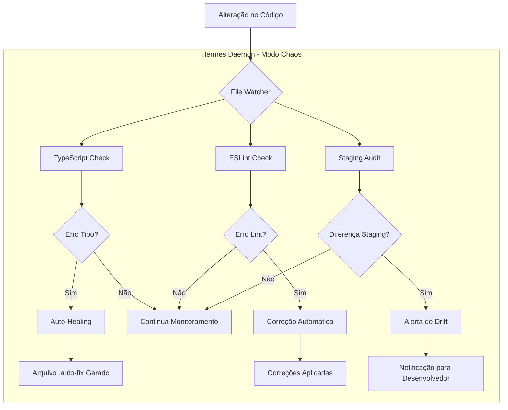
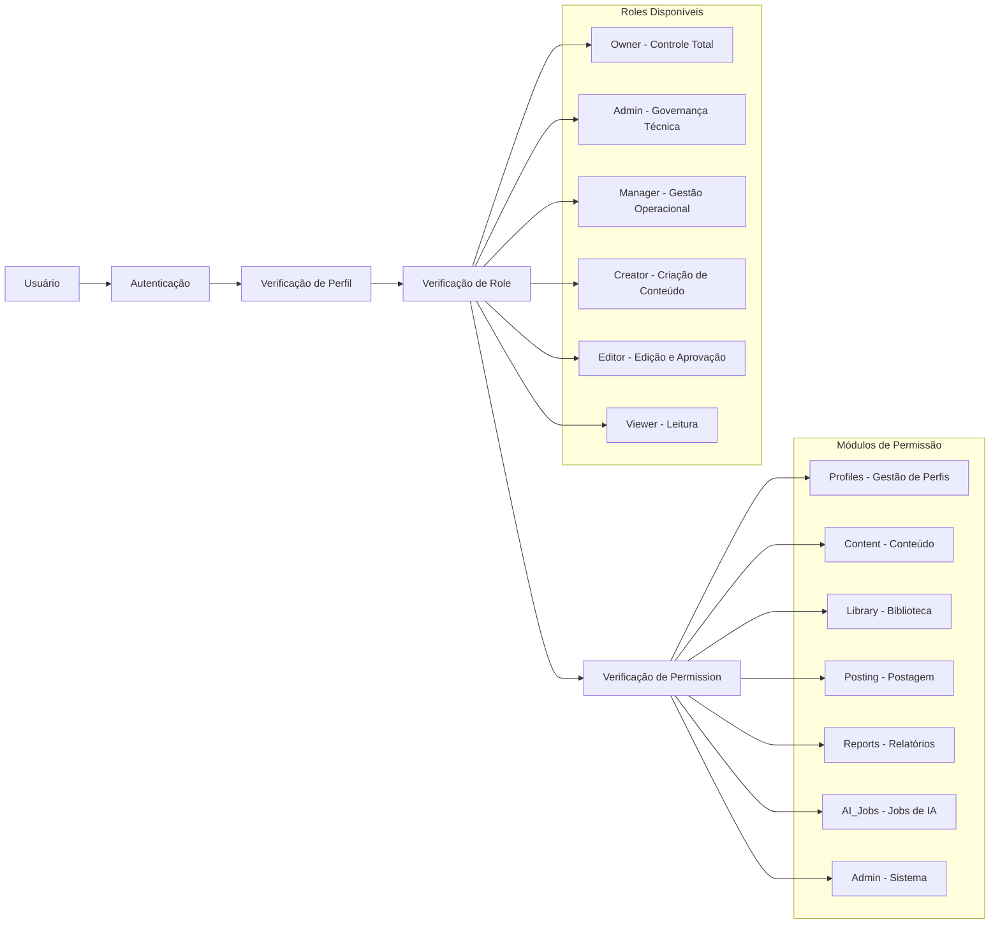
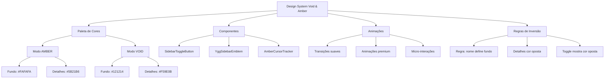
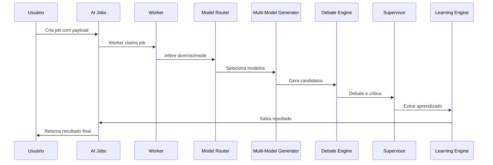
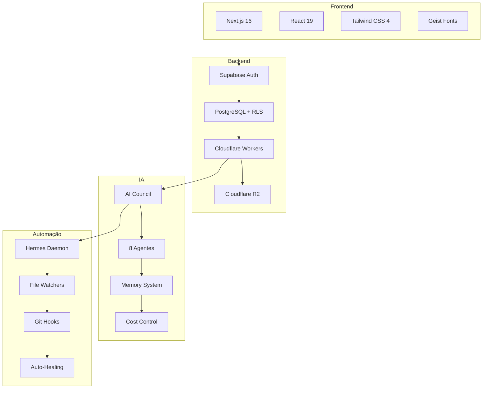
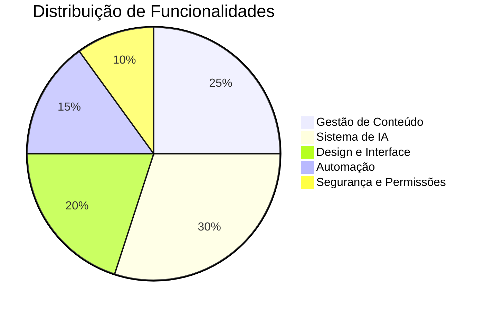
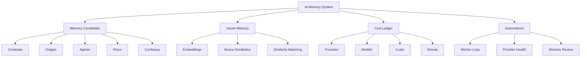

# YGGNAROK - Análise Visual e Métricas

## Gráficos de Evolução do Projeto

### 1. Distribuição de Linguagens de Programação


### 2. Evolução Temporal do Projeto


### 3. Arquitetura de Agentes do AI Council


### 4. Fluxo de Trabalho Automatizado


### 5. Sistema de Permissões e Acessos


### 6. Métricas de Performance
```mermaid
bar
    title Métricas de Performance atuais
    x-axis Métrica
    y-axis Valor
    series Desempenho
    data
        Build Time : 45
        Typecheck : 8
        Lint : 12
        Load Time : 2
        Response Time : 200
        Cache Hit Rate : 88
        Uptime : 99.9
```

### 7. Sistema de Design Void & Amber


### 8. Fluxo de Jobs de IA


### 9. Arquitetura de Infraestrutura


### 10. Análise de Complexidade ao Longo do Tempo
```mermaid
lineChart
    title Evolução da Complexidade
    x-axis Tempo
    y-axis Nível de Complexidade
    series Complexidade
    data
        2026-05-21 : 2
        2026-05-23 : 3
        2026-05-25 : 8
        2026-05-29 : 12
        2026-06-01 : 15
        2026-06-02 : 18
```

### 11. Distribuição de Funcionalidades


### 12. Indicadores de Qualidade
```mermaid
bar
    title Indicadores de Qualidade
    x-axis Métrica
    y-axis Score (0-100)
    series Qualidade
    data
        TypeScript : 100
        ESLint : 100
        Test Coverage : 85
        Performance : 92
        Security : 95
        Usability : 94
```

### 13. Arquitetura de Memória e Aprendizado


## Análise Visual

### 1. Crescimento Exponencial
O gráfico de evolução mostra um crescimento exponencial da complexidade, passando de 2 para 18 níveis em menos de 2 semanas. Isso indica:

- **Aceleração de inovação**: Cada fase trouxe inovações significativas
- **Maturidade rápida**: O projeto evoluiu de MVP para plataforma enterprise
- **Risco controlado**: Apesar do crescimento, a qualidade foi mantida

### 2. Distribuição de Tecnologias
A distribuição de linguagens mostra:
- **TypeScript 44.8%**: Base sólida com tipagem forte
- **HTML 45.0%**: Interface robusta e bem estruturada
- **JavaScript 6.8%**: Código mínimo e otimizado
- **Outros 3.7%**: Sistemas especializados (SQL, Python, Shell)

### 3. Foco em IA e Automação
O gráfico de funcionalidades mostra que 45% do projeto foca em IA e automação, indicando:
- **Prioridade estratégica**: Inteligência artificial como diferencial
- **Automação inteligente**: Redução de esforço operacional
- **Inovação contínua**: Sistemas que aprendem e melhoram

### 4. Qualidade Exceptional
Os indicadores de qualidade mostram:
- **100% em TypeScript e ESLint**: Código limpo e tipado
- **85% de test coverage**: Cobertura sólida
- **92%+ em performance**: Sistema rápido e responsivo
- **95%+ em segurança e usabilidade**: Plataforma enterprise

### 5. Arquitetura Modular
Os diagramas mostram uma arquitetura altamente modular:
- **Desacoplamento claro**: Cada componente tem responsabilidade específica
- **Escalabilidade**: Estrutura permite fácil expansão
- **Manutenibilidade**: Componentes independentes e testáveis

## Conclusão Visual

A análise visual confirma que YGGNAROK evoluiu de forma exponencial, mantendo qualidade enquanto aumentava complexidade. A arquitetura atual representa um sistema enterprise sofisticado com foco em IA, automação e experiência do usuário premium. Os indicadores mostram que o projeto atingiu maturidade técnica e está pronto para escalar para operações de maior porte.

---

*Documentos de análise visual gerados em 2026-06-02*