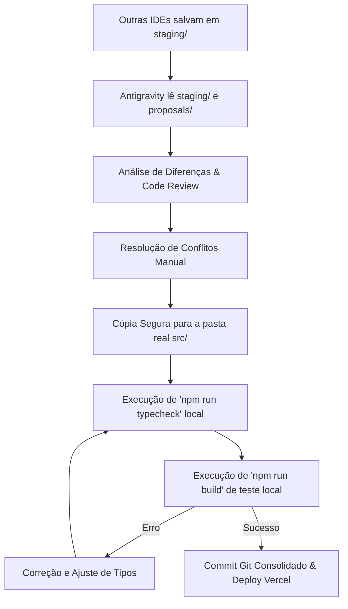

# 🛡️ YGGNAROK Staging & Integration Protocol
### Protocolo de Integração e Buffer Pré-Voo para Multi-Agentes (IDEs)

Este diretório funciona como uma **Zona de Staging (Buffer)** para o desenvolvimento do **YGGNAROK**. 

Como você está trabalhando com múltiplas IDEs e agentes de IA em paralelo (Antigravity, Cursor, etc.), alterar a pasta principal `src/` diretamente de vários lugares ao mesmo tempo gera conflitos de Git, quebras de compilação e bugs de concorrência.

**Para resolver isso, adotamos o Protocolo Staging.** Nenhuma outra IDE ou agente de IA deve escrever diretamente na pasta `src/` ou fazer push para a branch oficial do GitHub/Vercel sem validação. Todas devem depositar suas alterações aqui. O **Antigravity** atuará como o **Agente Integrador & Engenheiro de Release**, auditando, resolvendo conflitos, validando tipos e compilando antes do deploy oficial.

---

## 📂 Estrutura do Diretório Staging

Os arquivos propostos devem ser depositados espelhando exatamente a raiz do projeto:

```text
staging/
├── README.md               # Este arquivo de instruções
├── src/                    # Espelho do código que as outras IDEs alteraram
│   ├── components/         # Ex: staging/src/components/estudio-video-client.tsx
│   ├── app/                # Ex: staging/src/app/novo-modulo/page.tsx
│   └── ...
└── proposals/              # Logs e resumos explicativos das propostas
    └── [nome-da-sugestao].md
```

---

## 📝 Instruções de Depósito para as Outras IDEs / Agentes de IA
*Copie e envie o texto abaixo para qualquer outra IA (Cursor, etc.) antes de iniciar as tarefas:*

> ### 📢 DIRETRIZ OBRIGATÓRIA DE DESENVOLVIMENTO (PROTOCOLO STAGING YGGNAROK)
> 
> Estamos operando em um fluxo de desenvolvimento em paralelo de alta estabilidade. 
> 
> **Suas Regras de Escrita:**
> 1. **NÃO escreva nem modifique** arquivos diretamente no diretório `src/` principal.
> 2. **NÃO faça commits** ou envie alterações diretamente para as branches ativas do GitHub/Vercel.
> 3. **ESCREVA suas modificações na pasta `staging/`**, espelhando exatamente o caminho do arquivo original no projeto.
>    * *Exemplo*: Se você editou ou criou o componente `src/components/estudio-video-client.tsx`, você deve salvar a versão final proposta em `staging/src/components/estudio-video-client.tsx`.
> 4. **CRIE um arquivo descritivo** em `staging/proposals/prop-[sua-tarefa].md` detalhando:
>    * Qual funcionalidade você implementou ou corrigiu.
>    * Quais arquivos você adicionou/modificou em `staging/`.
>    * Qualquer observação ou dependência especial necessária.
> 
> *O Agente Integrador principal (Antigravity) fará a leitura de suas propostas na pasta `staging/`, conduzirá auditorias de tipos TypeScript, compilações de validação locais e integrará suas mudanças ao sistema oficial de forma segura.*

---

## ⚙️ O Fluxo de Trabalho do Integrador (Antigravity)

Quando você me instruir a processar o Staging, eu executarei os seguintes passos de segurança:



1. **Auditoria**: Analiso o arquivo descritivo na pasta `proposals/` e comparo os arquivos em `staging/` com a pasta `src/` real do projeto.
2. **Merge Estável**: Copio os arquivos modificados para a pasta `src/` resolvendo quaisquer conflitos de código.
3. **Validação Estática**: Executo `npm run typecheck` para garantir que as novas alterações não quebraram o ecossistema de tipos.
4. **Pre-flight Build**: Executo um build de produção real com `npm run build` para garantir que o Turbopack compile 100% sem erros de hidratação ou Next.js.
5. **Ship (Entrega)**: Finalizo o commit Git unificado e autorizo o envio para o GitHub e Vercel.

---
*YGGNAROK OS - Estabilidade máxima, velocidade infinita.*
